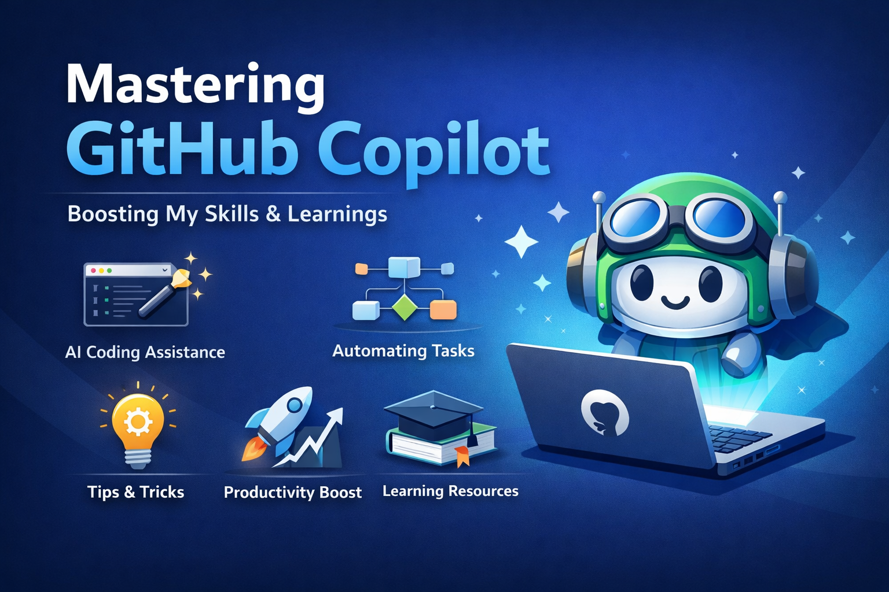

<!-- ========================================================= -->
<!-- ============== GITHUB COPILOT SHOWCASE ================== -->
<!-- ========================================================= -->

<p align="center">
  
</p>

<h1 align="center">🤖 GitHub Copilot – AI Coding Companion Showcase</h1>

<p align="center">
  <b>Interactive AI Coding Assistance • Workflow Automation • UI/UX-Driven Learning Hub</b><br>
  A hands-on, visual-first showcase of how GitHub Copilot accelerates real-world development, from first prompt to production-ready code.
</p>

---

## 📘 Repository Overview

```text
Repository Name    : GitHub Copilot Showcase
Author             : Ashwin18-Offcl
Primary Focus      : Exploring GitHub Copilot usage, workflows, prompts & UI/UX-centric visual assets
Learning Levels    : Beginner → Intermediate → Applied Developer Workflows
Skills Highlighted : AI-Assisted Coding -  IDE Integration -  Prompt Engineering -  Visual Documentation
Usage              : Learning -  Live Demonstration -  Portfolio -  Tech Talk Companion
Outcome            : Clear understanding of GitHub Copilot real use cases, strengths & limitations
```

This repository is a compact but expandable hub that demonstrates GitHub Copilot integration, prompt patterns, and learning visuals so developers, learners, and reviewers can quickly see AI-assisted coding in action. [web:3][web:8]

---

## 🌟 Key Highlights (At a Glance)

- **Live-like demo structure**: Organized as “mini episodes” you can open and follow inside your IDE.
- **UI/UX visual focus**: Banners, thumbnails, and panel-style mockups that simulate Copilot suggestions.
- **Prompt-first thinking**: Files and sections showcasing *how* to talk to Copilot, not just what it outputs. 
- **Portfolio-ready design**: Clean, modern layout optimized for GitHub profile visitors.

---

## 🎯 What This Repository Contains

### ✨ Visual Thumbnail & UI Banner

- Hero banner and thumbnail designed to reflect progression from beginner exploration to confident Copilot usage.
- Space reserved for future GIFs/screenshots of Copilot suggestion panels and before/after code views.

### 📂 Python Project Context

- A minimal, focused Python workspace to demonstrate:
  - Function completions and refactors.
  - Docstring and test generation using Copilot prompts.
  - Small utilities built faster with AI assistance. 

### 🧪 Scenario-Based Demo Folders (Planned/Expandable)

> Example structure you can adopt:

```text
📁 /demos
 ├─ 01-starter-suggestions/
 ├─ 02-refactor-with-ai/
 ├─ 03-tests-and-docs/
 ├─ 04-api-integrations/
 └─ 05-ui-snippets-and-prompts/
```

Each folder can include:
- `README.md` with the scenario explanation.
- `before.py` and `after.py` to show transformation with Copilot.
- Prompt notes (`prompts.md`) capturing what you typed to Copilot. 

### 📘 Practical Code Demonstrations (Planned)

This area is intended to contain:
- Copilot-enhanced scripts (utilities, refactors, unit tests).
- Examples of converting comments to code and vice versa.
- Small automation snippets for routine dev tasks (e.g., parsing logs, generating boilerplate). 

### 📈 Skill & Feature Showcases

Focused on demonstrating:

- Effective use of AI coding tools in real development, not “toy-only” examples.   
- Integration inside IDE workflows (VS Code, JetBrains, Neovim configs or screenshots). 
- UI/UX visuals for:
  - Copilot inline suggestions.
  - Chat-based explanations.
  - Diff-style before/after comparisons. 
---

## 🚀 Why This Repository Matters

GitHub Copilot acts as an AI partner that helps you: [web:3]

- Write repetitive or boilerplate code faster so you can focus on logic and architecture.
- Get natural-language explanations for unfamiliar code segments.
- Automate routine tasks like test scaffolding and documentation drafts.
- Explore multiple implementation alternatives in real time by adjusting your prompts.
By combining visual cues, structured examples, and clear prompts, this repo showcases **developer readiness** in an AI-first world instead of just theory or static notes.

---

## 🧠 Copilot in Developer Workflows

Here’s a conceptual workflow you can document and visualize:

1. **Idea → Prompt**  
   - Start with a natural-language description of the feature or function you want.
2. **Prompt → Draft Code**  
   - Let Copilot generate an initial implementation directly in your editor. 
3. **Draft → Review & Refine**  
   - Manually inspect, refactor, and optimize the AI-suggested code.  
4. **Refine → Tests & Docs**  
   - Use Copilot to bootstrap unit tests, docstrings, and README snippets. 
5. **Ship → Learn**  
   - Capture what worked, what didn’t, and update prompts and patterns for next time. 

You can represent this flow with:
- A simple ASCII diagram in the README.
- A visual flow graphic in `/assets/workflows/`.

## 🔍 How You Can Use This Repository

### 📌 For Yourself (Skill Growth)

- Practice prompt design and contextual coding with small, focused exercises. 
- Observe how Copilot behaves in different file types and contexts (Python, Markdown, config).   
- Build a personal library of “prompts that worked” for common tasks.

### 📌 For Your Portfolio

- Link this repository directly in your main profile README to showcase AI-assisted workflows. 
- Use thumbnails, GIFs, and banners as visual proof of your UX thinking. 
- Add short write-ups on:
  - “How I use Copilot in daily coding.”
  - “Where I still prefer manual implementation.”

### 📌 For Sharing with Peers / Talks

- Use the demo folders as live coding segments during meetups, workshops, or online sessions. 
- Show side-by-side editor screenshots (with and without Copilot suggestions).  
- Encourage others to compare workflows across editors (VS Code, JetBrains, Neovim, etc.). 

---

## 🧩 Extra Creative Sections You Can Add

### 📚 Curated Copilot Prompt Library (Planned)

Create a `/prompts` folder with markdown files like:

- `01-setup-and-boilerplate.md`
- `02-refactor-and-cleanup.md`
- `03-tests-and-docs.md`
- `04-debugging-helpers.md`

Each file can include:
- Scenario description.
- Example prompts.
- Notes on what worked best. [web:1][web:14]

### 🎥 Visual & Video Walkthroughs (Planned)

In `/visuals` or `/media`:

- Short GIFs of:
  - Copilot autocompleting functions.
  - Chat explanations of complex blocks of code.
- Links to YouTube or devlog-style videos walking through one demo folder end-to-end.

### 🧪 Before / After Code Gallery

A dedicated section or folder like `/before-after`:

- `feature_before.py` vs `feature_after_copilot.py`
- Annotated diffs in markdown explaining what exactly Copilot improved or accelerated.

---

## 🔭 Roadmap & Future Enhancements

Planned improvements:

- 🔹 Curated Copilot prompt examples with tags (e.g., `#testing`, `#refactor`, `#api`).
- 🔹 Embedded code walkthrough videos and GIFs for key scenarios. 
- 🔹 Real before/after coding comparisons with annotations.  
- 🔹 UI/UX galleries showcasing suggestion panels and flow diagrams.  
- 🔹 Feedback sections (via issues or markdown forms) for each demo: “What did this example teach you?”  

You can also add a simple checklist like:

```text
[ ] Add 3 complete Python demo flows
[ ] Record 1 short Copilot walkthrough video
[ ] Publish prompt library v1
[ ] Add screenshots for VS Code + JetBrains setups
```

---

## 🧑‍💻 About the Author

**Ashwin18-Offcl**  
Aspiring AI-assisted Developer • Python Enthusiast

<p align="center">
  <a href="https://github.com/Ashwin18-Offcl">
    
  </a>
</p>


---

## 📌 Final Positioning

This repository is not just code — it is a **modern, AI-powered coding portfolio starter**, combining visual storytelling, prompt-driven learning, and concrete Copilot workflows to show how you build smarter with today’s tools. [web:3][web:4][web:7][web:14]

Use it as:
- A living playground for AI-assisted development.
- A reference for your future projects.
- A showcase piece for interviews, reviews, and tech talks.
